# TableLLM
This primary goal of this project is to explore the capabilities of LLMs when it comes to answering numerical and logical reasoning questions from tabular data. As such, we have looked into various different approaches and families of LLMs to gauge their applicability and feasability in terms of time and resource usage.

## Models
We have tested many different LLMs, but we eventually narrowed our search down to the following:
1) Llama-3.1-8B-Instruct
2) Qwen-2.5-7B-Instruct 

## Strategies
There were two main strategies that we resorted to:
1) Prompt Engineering
2) Fine-Tuning

We started with prompt engineering to assess the capabilities of the base models that we were working with. After that, we tried to employ fine-tuning to see if the performance of each of the models could be improved.

## Datasets
The FinQA dataset by IBM had been chosen for prompt engineering and fine-tuning the chosen LLMs, as it had a reasonably large number of samples, each with a table, contextual text, a question, the reasoning steps needed to answer the question, and the final calculated answer.
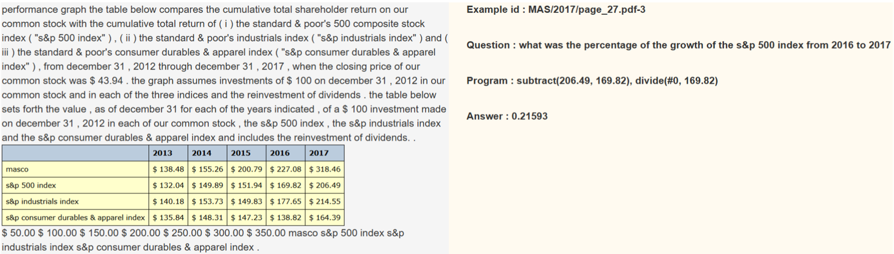
For testing purposes, we made two custom version of the dataset, one containing an extra field that has the reasoning steps shown in the program field in postfix notaion, while the other has the extra field showing the reasoning steps in infix notation.

The HiTab dataset, which is a Hierarchical tabular dataset made for question-answering and data-to-text tasks, has been used for analysing the performance of the fine-tuned models.
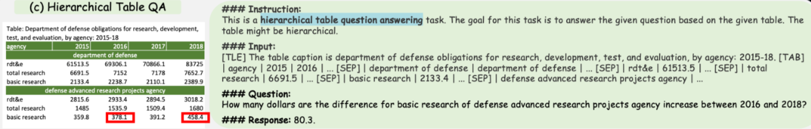

## Prompt Engineering
We have explored many different prompting techniques for this project. The following yielded the best results:
1) Few shot prompting [please add some description for this!]
2) Chain of thought prompting
3) Self-Consistency prompting

### Chain of thought
Chain of thought prompting has been used with the Qwen-2.5-7B-Instruct model and the following are the prompts and results:
#### Prompt Structure
With original dataset:
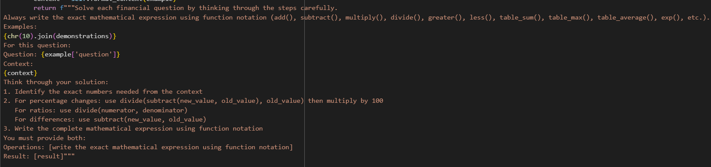

With infix dataset:
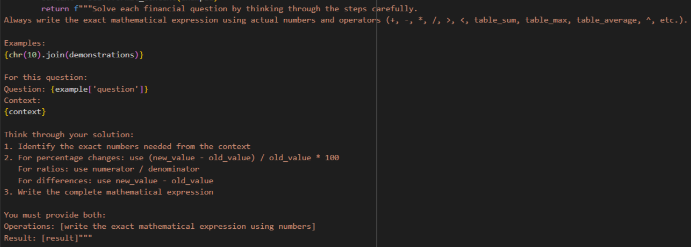

#### Results
RougeL F1 scores:
* Original Dataset: 0.293
* Infix dataset: 0.496

Example of a response with the original dataset:
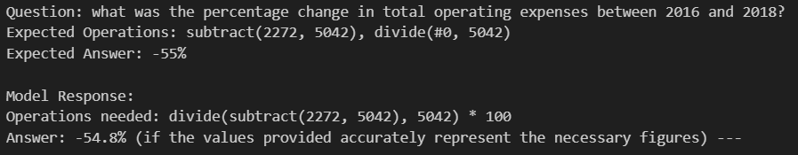

Example of a response with the infix dataset:
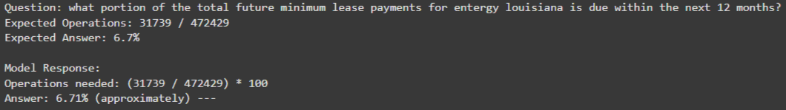

### Self-Consistency
Self-Consistency has also been used with Qwen-2.5-7B-Instruct and the following are the prompts and results:

#### Prompt Structure
With original dataset:
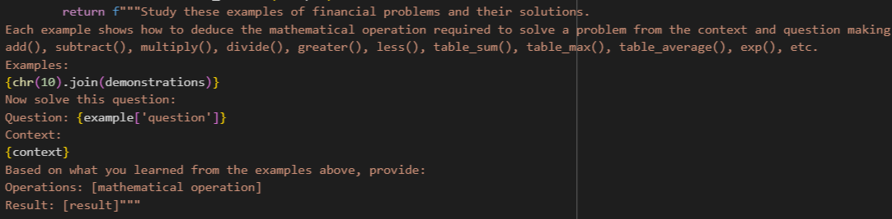

With infix dataset:
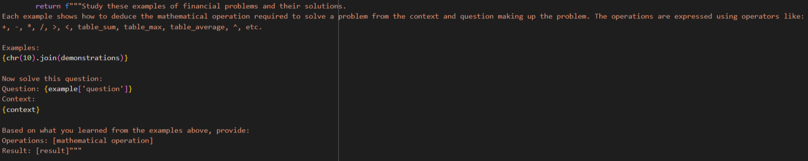

#### Results
RougeL F1 scores:
* Original dataset: 0.293
* Infix dataset: 0.514

Example of a response with the original dataset:
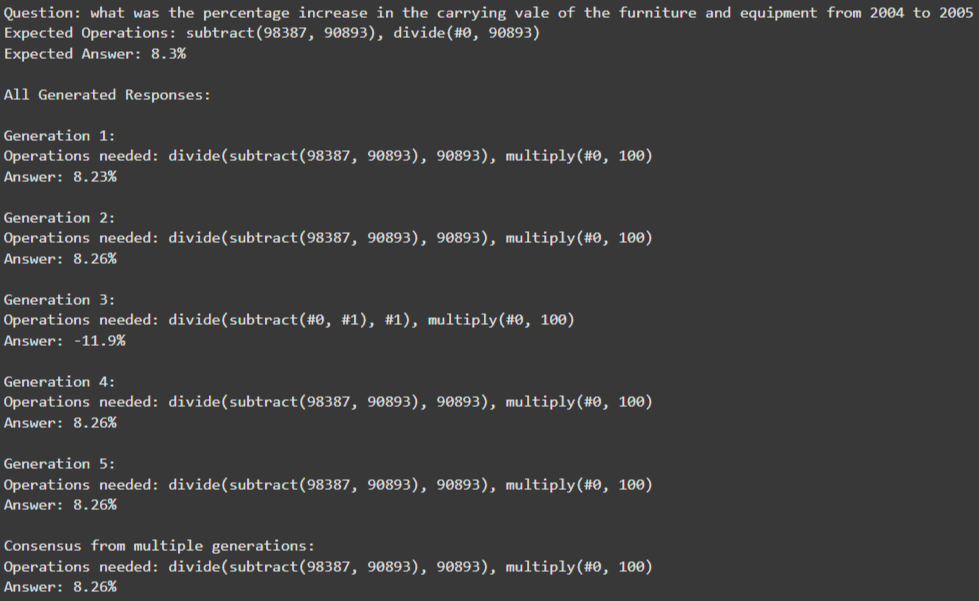

Example of a response with the infix dataset:
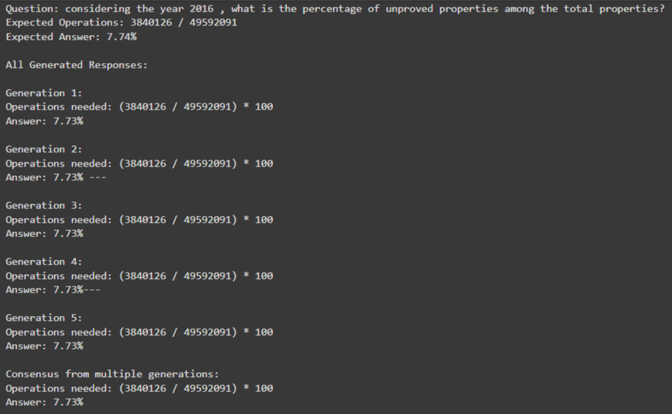

## Fine-Tuning
After testing the models with different prompting techniques, we decided to fine-tune the models on the FinQA dataset. For this, we used Unsloth, as it significantly reduces the memory requirement for the fine-tuning process.

### Qwen-2.5-7B-Instruct
From the prompt engineering, we saw that the model performed much better with the infix notation. However, in the preliminary stages of the fine-tuning process, this particular model seemed to perform noticeably better with the original dataset. Hence, for the full fine-tuning, the original dataset was used instead of the one with infix notation.

#### Preliminary Results
RougeL F1 scores:
* Infix dataset: 0.522
* Original dataset: 0.632

Cosine Similarity scores:
* Infix dataset: 0.452
* Original dataset: 0.675

In the preliminary stage of the fine-tuning process, only 800 of the 6,251 training examples were used. It was, therefore, expected that using the entire training split of the dataset would yield much better results.

#### Final Results
Fortunately, training the model on the entire training set did give markedly better results as shown below:
* RougeL F1 score: 0.743
* Cosine Similarity score: 0.828

The following is a sample response from the final fine-tuned model:
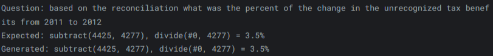

#### Prompt
The prompt used for the final fine-tuning process is shown below:
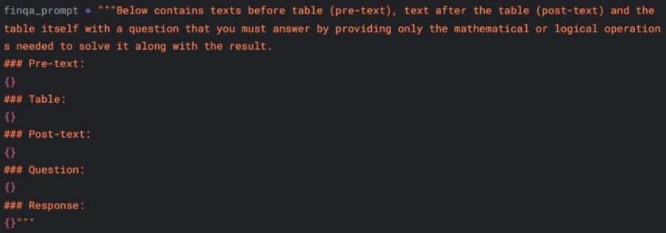

## Links:
* [Fine-Tuned Qwen-2.5-7B-Instruct](https://huggingface.co/n3Er/qwen2.5-7b-instruct-finqa-ht)
* [Infix Dataset](https://huggingface.co/datasets/n3Er/FinQA-Infix)
* [Postfix Dataset](https://huggingface.co/datasets/n3Er/FinQA-Postfix)
